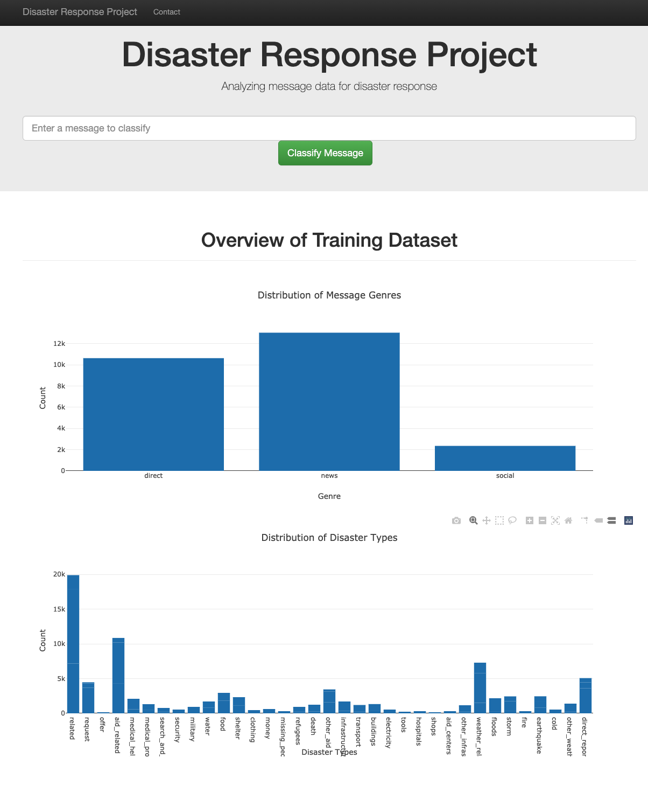
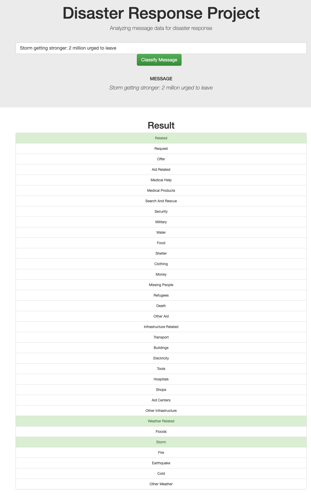

# Disaster Response Pipeline Project

### Project Overview
The project is designed to build a model for an API that is able to digest real disaster messages from Figure Eight and automatically categorize and send the messages to an appropriate disaster relief agency.

The final product will include a web app where an emergency worker can input a new message and get classification results in several categories. Also it is able to display visualizations of the data.

### File Structures
  - data:The folder contains messages and categories dataset.
  - app: The folder includes files to run and render the web app.
  - data/process_data.py: The python file processes the original input files (categories, messages dataset) and creates SQLite database containing a cleaned dataset.
  - models/train_classifier.py: The python file leverages the processed message and categories dataset, applied machine learning model and identified the optimal model which is able to classified the messages into different categories.
  - ETL Pipeline Preparation.ipynb: The code in this ipynb is used to develop process_data.py.
  - ML Pipeline Preparation.ipynb: The code in this ipynb is used to develop train_classifier.py.

### Setup Instruction

1. Run the following commands in the project's root directory to set up your database and model.

    - To run ETL pipeline that cleans data and stores in database
        `python data/process_data.py data/disaster_messages.csv data/disaster_categories.csv data/DisasterResponse.db`
    - To run ML pipeline that trains classifier and saves
        `python models/train_classifier.py data/DisasterResponse.db models/classifier.pkl`

2. Run the following command in the app's directory to run your web app.
    `python run.py`

3. Go to http://0.0.0.0:3001/

### App Screenshot

* Visualization Overview Screenshot

* Classification Output Screenshot

###
